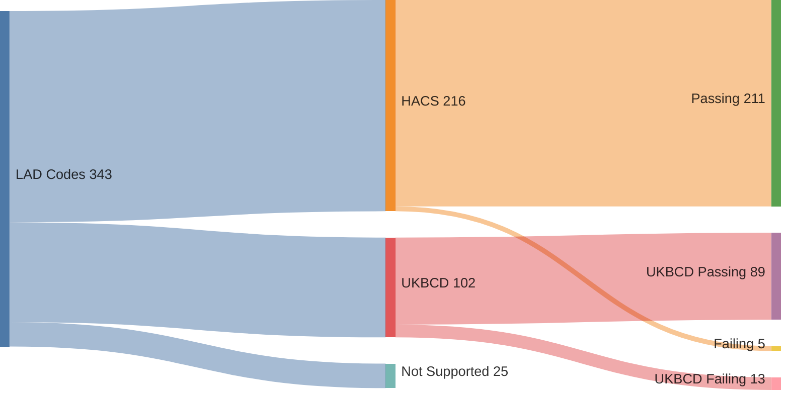

# UK Bin Collection API


An API that tells you when your bins are being collected. Enter a postcode, pick your address, get your collection dates back as JSON or subscribe via iCal.

Under the hood, it pulls from about 350 council scrapers maintained by two community projects — [hacs_waste_collection_schedule](https://github.com/mampfes/hacs_waste_collection_schedule) and [UKBinCollectionData](https://github.com/robbrad/UKBinCollectionData) — patches them to run as async Python, and serves them through a single FastAPI app.

## Coverage



HACS scrapers (~240) are the primary source. UKBinCollectionData scrapers (~110) fill gaps where HACS has no coverage or where a HACS scraper is broken. The [coverage map](https://bins.09steic.com/coverage) shows which councils are supported.

## API

Base URL: `https://ukbinday.co.uk`

| Endpoint | Description |
|---|---|
| `GET /api/v1/addresses/{postcode}` | List addresses for a postcode (with UPRNs) |
| `GET /api/v1/lookup/{uprn}` | Get bin collection dates for a UPRN |
| `GET /api/v1/calendar/{uprn}` | iCal feed for calendar subscriptions |
| `GET /api/v1/council/{postcode}` | Identify which council covers a postcode |
| `GET /api/v1/councils` | List all supported councils |
| `GET /api/v1/health` | Health check |

Interactive docs at [`/api/v1/docs`](https://ukbinday.co.uk/api/v1/docs).

## Setup

Python 3.13+ and [uv](https://docs.astral.sh/uv/).

```bash
uv sync
uv run uvicorn api.main:app --reload
```

The app runs at `http://localhost:8000`.

Rate limiting needs Redis — set `REDIS_URL` or just leave it off and the API works without it.

## Tests

```bash
uv run pytest tests/test_ci.py -v          # smoke tests: syntax, imports, registry (~1s)
uv run pytest tests/test_frontend.py -v    # API routes, CORS, error cases (~1s)
uv run pytest tests/test_integration.py -v # hits live council sites (~40s)
uv run pytest tests/test_playwright.py -v  # browser-based scrapers, needs Chromium (~5min)
uv run pytest tests/test_deploy.py -v      # Docker compose stack (~60s)
```

Run a single council with `-k`:

```bash
uv run pytest tests/test_integration.py -v -k "aberdeen"
```

## Syncing scrapers from upstream

The scrapers in `api/scrapers/` are patched copies of the upstream originals. The sync scripts clone each upstream repo, apply AST transforms (converting `requests` calls to async `httpx`), and drop the results into the scrapers directory.

```bash
pipeline/hacs/sync.sh    # primary source
pipeline/ukbcd/sync.sh   # fallback source
```

After syncing, regenerate the lookup data:

```bash
uv run python -m pipeline.hacs.generate_test_lookup
uv run python -m pipeline.ukbcd.generate_test_lookup
uv run python -m scripts.generate_admin_lookup
```

## Deployment

Docker Compose stack: API + Redis + Caddy (reverse proxy, auto TLS) + Uptime Kuma (monitoring).

```bash
docker compose up --build
```

See [deploy/deployment.md](deploy/deployment.md) for Hetzner provisioning and production setup.

## Linting

```bash
uv run ruff check --fix          # Python (scrapers excluded)
npx @biomejs/biome check --write  # JS/JSON
```

Pre-commit hooks via [lefthook](https://github.com/evilmartians/lefthook) run linting, smoke tests, and scraper sync checks automatically.

## Acknowledgements

This project wouldn't exist without the scraper collections built by [mampfes/hacs_waste_collection_schedule](https://github.com/mampfes/hacs_waste_collection_schedule) and [robbrad/UKBinCollectionData](https://github.com/robbrad/UKBinCollectionData). If your council isn't supported, consider contributing a scraper to one of those projects.
