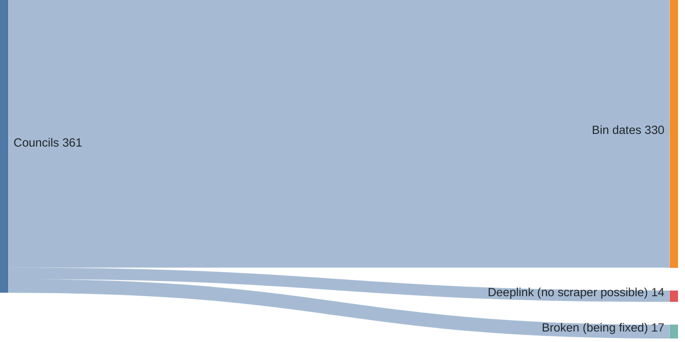

# UK Bin Collection API


An API that tells you when your bins are being collected. Enter a postcode, pick your address, get your collection dates back as JSON or subscribe via iCal.

Each council is a module in `api/councils/`, served through a single FastAPI app. The modules started as ports of two community projects, [hacs_waste_collection_schedule](https://github.com/mampfes/hacs_waste_collection_schedule) and [UKBinCollectionData](https://github.com/robbrad/UKBinCollectionData), and are now maintained here.

## Coverage

<!-- coverage:start -->

```mermaid
---
config:
  sankey:
    width: 800
    height: 400
    linkColor: source
    nodeAlignment: left
---
sankey-beta

"Councils","Bin dates",330
"Councils","Deeplink (no scraper possible)",14
"Councils","Broken (being fixed)",17
```

Of 361 councils, 330 return bin dates. The other 31 send users to the council's own bin-day page:

**Deeplinked by design (14)**: the council's lookup can't be scraped.

| Council | Why |
|---|---|
| Brighton and Hove | Mendix platform, no plain-HTTP path (reference case) |
| Causeway Coast and Glens | no address lookup exists, only 4 area calendar PDFs with colour-only week marking and no address-to-area mapping |
| City of London | no address lookup feed exists, estate-based collections via Veolia with static pages only |
| Coventry | Coventry's bin-day search is behind a reCAPTCHA. |
| Derry City and Strabane | no address lookup exists, one generic calendar image; the Sentireal app backend is not publicly reachable |
| Fylde | Bartec portal behind mandatory login, no guest lookup (dead by redesign) |
| Halton | ASP.NET WebForms behind reCAPTCHA v2, server-side validator rejects guest POSTs with no data endpoint |
| Havant | Havant's bin days are only shown after logging in to a council account. |
| Isle of Wight | Blazor Server app (state over a SignalR WebSocket, no HTTP data endpoint) and bin types only as PDF cell colours that change yearly (2026-10-01) |
| Isles of Scilly | no address lookup exists, static round map + area table only (no kerbside off St Mary's/St Martins) |
| North East Derbyshire | Firmstep Check_your_Bin_Day retired (302, button commented out), static Calendar A/B only; apibroker 403 |
| Preston | Preston's bin-day search answers every automated request with an image captcha. |
| Rutland | bin lookup behind Salesforce MyAccount login wall, no guest flow |
| Southampton | whole domain behind Incapsula, 403 on all server-side fingerprints, no alternate API |

**Broken (17)**: a scraper exists but failed the last live run, usually because the council's site is down.

| Council | Last run |
|---|---|
| Ards and North Down | broken / upstream_error |
| Bolsover | broken / upstream_error |
| Boston | broken / upstream_error |
| Cheltenham | broken / upstream_error |
| Chichester | broken / upstream_error |
| East Lindsey | broken / upstream_error |
| Eastleigh | broken / upstream_error |
| Enfield | broken / upstream_error |
| Fenland | broken / upstream_error |
| Gateshead | broken / upstream_error |
| Great Yarmouth | broken / upstream_error |
| South Ayrshire | broken / upstream_error |
| South Hams | broken / scraper_error |
| Stockton-on-Tees | broken / upstream_error |
| Sunderland | broken / upstream_error |
| Swale | broken / upstream_error |
| West Devon | broken / upstream_error |
<!-- coverage:end -->

The [coverage map](https://ukbinday.co.uk/coverage) shows each council on a map.

## API

Base URL: `https://ukbinday.co.uk`

| Endpoint | Description |
|---|---|
| `GET /api/v2/find?postcode=` | The council covering a postcode (its LAD code), and its addresses with UPRNs |
| `GET /api/v2/{lad}/view/{uprn}` | Bin collection dates for a UPRN |
| `GET /api/v2/{lad}/subscribe/{uprn}` | iCal feed for calendar subscriptions |
| `GET /api/v2/{lad}/download/{uprn}` | The same iCal feed as a file download |
| `GET /api/v2/councils` | List all supported councils |
| `GET /api/v2/health` | Health check |

`{lad}` is the council's ONS LAD code (e.g. `E06000001`). Interactive docs at [`/api/v2/docs`](https://ukbinday.co.uk/api/v2/docs).

## Setup

Python 3.13+ and [uv](https://docs.astral.sh/uv/).

```bash
uv sync
uv run uvicorn api.main:app --reload
```

The app runs at `http://localhost:8000`.

Rate limiting needs Redis — set `REDIS_URL` or just leave it off and the API works without it.

## Tests

```bash
uv run pytest -m ci -v                    # smoke tests: syntax, imports, registry (~1s)
uv run pytest -m api -v                   # API routes, CORS, error cases (~1s)
uv run pytest -m live -v                  # every council against live sites (~7 min)
uv run pytest -m docker -v                # Docker compose stack (~60s)
uv run pytest -m "not live and not docker" -v  # all fast tests
```

The live test (`tests/test_lad_integration.py`) runs one test per council (LAD code), using real addresses sampled from ONS data and looked up the same way the frontend does. Run a few councils by LAD code:

```bash
LAD_CODES=S12000033,E08000035 uv run pytest tests/test_lad_integration.py -v
```

Test runs only write `tests/output/lad_integration_output.json`. To refresh the `working` flags, badge, sankey and coverage map from it, run `./pipeline/ci/post_integration.sh`.

## Adding or fixing a council

A council module declares the LAD codes it serves (`meta.lads`); see `scraper_contract.md` for the contract. After adding a module or changing its `lads` or `url`, recompose the council mapping and run the module against its cases:

```bash
uv run python -m scripts.lookup.build_lad_lookup --compose
uv run python -m scripts.councils.check <module>
```

Upstream still fixes its scrapers when a council changes its site. `scripts/upstream_watch.sh` lists new upstream commits that touch a council we serve; the pre-commit hook runs it at most once a day.

## Deployment

Production runs on Vercel, with the calendar cache in Cloudflare R2; every push to `main` deploys it. Locally, Docker Compose runs the API alone:

```bash
docker compose up --build
```

## Linting

```bash
uv run ruff check --fix          # Python
uv run ty check                  # type-checks api/councils/
npx @biomejs/biome check --write  # JS/JSON
```

Pre-commit hooks via [lefthook](https://github.com/evilmartians/lefthook) run linting, smoke tests and the daily upstream watch.

## Acknowledgements

This project wouldn't exist without the scraper collections built by [mampfes/hacs_waste_collection_schedule](https://github.com/mampfes/hacs_waste_collection_schedule) and [robbrad/UKBinCollectionData](https://github.com/robbrad/UKBinCollectionData). The council modules here began as ports of their scrapers.
